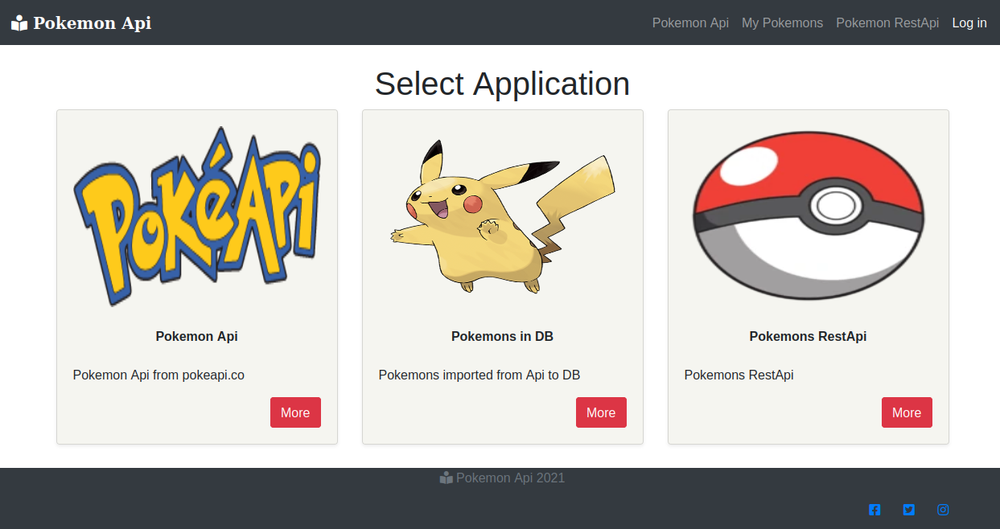
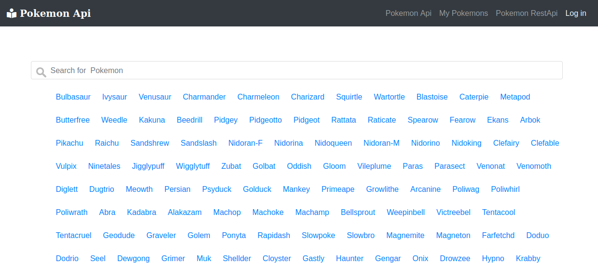
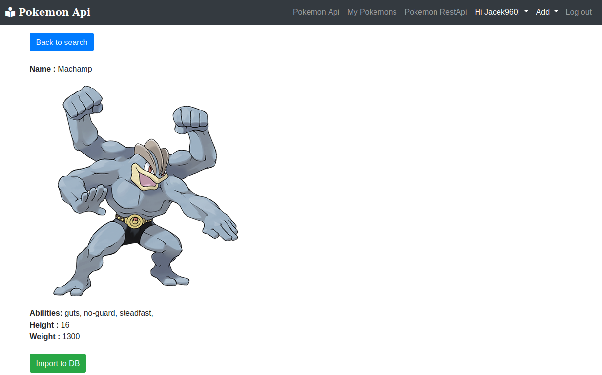
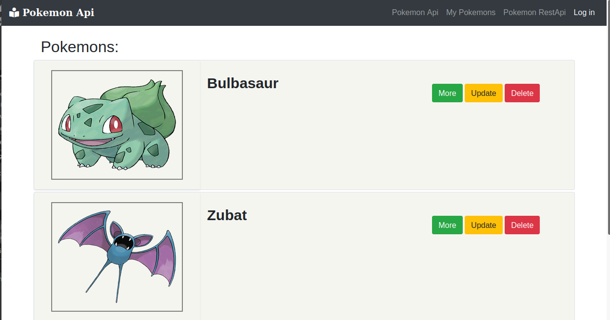
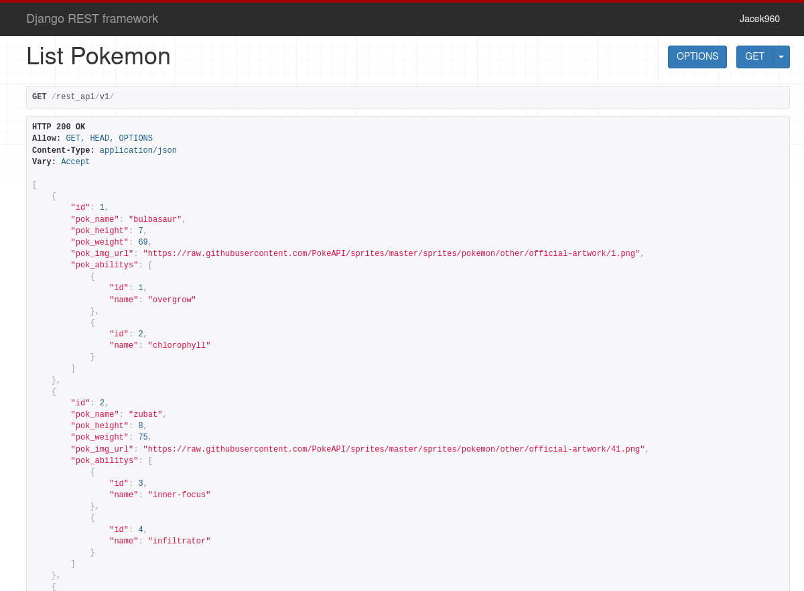

# Api and REST Api
> Website - Pokemons Api    
> [Live Version](https://gentle-coast-02039.herokuapp.com/)

## Table of contents
* [General info](#general-info)
* [Screenshots](#screenshots)
* [Technologies](#technologies)
* [Setup](#setup)
* [Features](#features)
* [Status](#status)
* [Credits](#credits)
* [Contact](#contact)

## General info
Project: 
Api from pokeapi.co 
Import data from pokeapi.co to DB.
RestApi data from DB.

## Screenshots
Home Page

Api from pokeapi.co 

Pokemon page

Pokemons imported to DB

Pokemon RestApi

## Technologies
* Django 3.1.2
* Python 3.8
* Bootstrap 4.0
* JavaScript

## Setup
Use pip installation to install dependencies from requirements.txt
## Code requirements.txt

`$ pip install -r requirements.txt`

## Features
To-do list:
* more data to import

## Status
Project is: _in_progress_ small changes to by done. 

## Credits
[pokeapi.co](https://pokeapi.co/)
[Heroku](https://dashboard.heroku.com/)
[Django](https://www.djangoproject.com/)
[Stackoverflow.](https://stackoverflow.com/)

## Contact
Created by [Jacek960](mailto:j.kuciel@outlook.com)- feel free to contact me!

